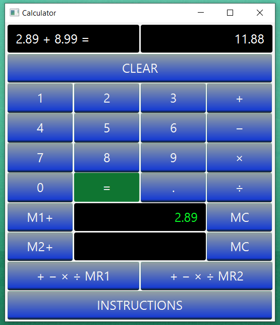

# Calculator

This a simple calculator to perform operations such as   -  +  ×  ÷  only between two numbers with or without decimals.
This calculator it's built using if, else if, switch statement, and data format up to three decimals.
Because I've used data format up to three decimals it means you can do any operation between two numbers whit up to three decimals
and you will get the result in the same way up to three decimals if is the case.

For example:

If you do 10 ÷ 2 = 5
If you do 10.01 ÷ 2 = 5.005
If you do 10.01 ÷ 2.51 = 3.988
If yoy do 10.99 × 2.56 = 28.134
If you do 28.134 ÷ 10.99 = 2.56

This calculator has two memory fields where you can store two results at the same time and then do any calculation whit that two memory
by using the individual buttons for each saved memory.

For example, you have saved two numbers

All you have to do is use the memory recall button and then the operation you want to perform and then the second memory recall button
and the equal button to get the result.
So you can add to memory, delete the memory, and make any calculation between the saved memorys.

Demo Images:

